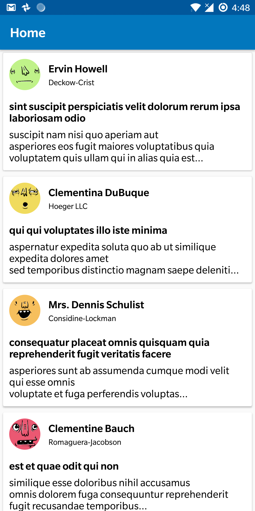
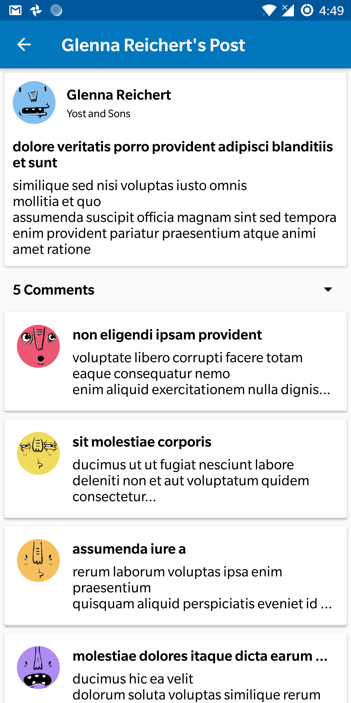
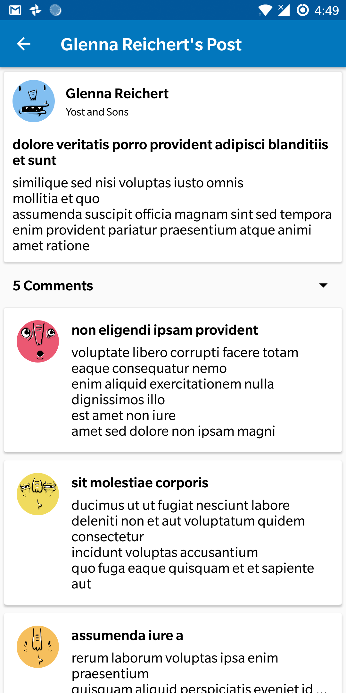

# GoodFeed

* An Android application that shows a vertical feed.
* Tapping on a Feed item takes the user to the Post Detail screen.
* Post Details show the full post along with user comments.

# Specials

* Feeds are stored in a Database for Offline Mode.
* Each user has a unique Avatar associated with it.

# Technical Info

* Written purely in Kotlin.
* Built on MVP architecture to facilitate separation of business logic & testability.
* Using the latest libraries like Architecture Components & Dagger for speedy caching and Dependency Injection.
* Mockito for testing the Presenters and ViewModel Transformers.
* Abstraction layers & Proxy patterns for Data / APIs for encapsulation.

# Screenshots

  
  
  

# Dependencies

* <b>Support:</b> AppCompat, Design, CardView, ConstraintLayout

* <b>Database:</b> Room

* <b>API and HTTP Calls:</b> Retrofit & OkHttp3

* <b>Dependency Injection:</b> Dagger2

* <b>Images:</b> Glide & CircleImageView

* <b>Events:</b> EventBus

* <b>Architecture Components:</b> Lifecycle, ViewModel

# Building & Publishing

* Use ./gradlew on the Project Root to build.
* Keystore & Signing Config has been included for convenience
* Use either <code>./gradlew assembleDebug</code> or <code>./gradlew assembleRelease</code>

# Data Sources

* Posts: http://jsonplaceholder.typicode.com/posts
* Users: http://jsonplaceholder.typicode.com/users
* Comments: http://jsonplaceholder.typicode.com/comments
* Avatars: https://api.adorable.io/avatars

# Download

<a href="https://github.com/CalvinNor/GoodFeed/raw/develop/apk/GoodFeed%201.0.apk">Click here to download!</a>
